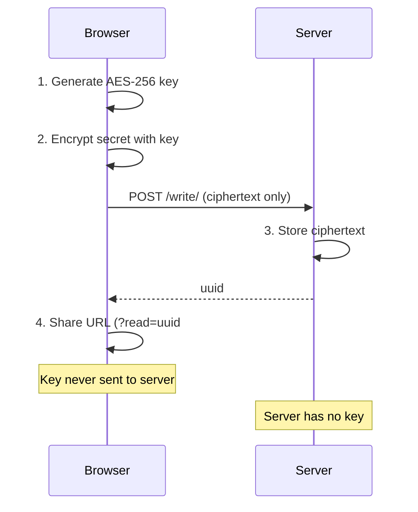

# Simple-OTS

A lightweight and secure "One Time Secret" solution for sharing sensitive information safely.


## Features

- **Zero-Knowledge Encryption**: Secrets are encrypted client-side using AES-256-GCM before leaving your browser. The server never sees the plaintext.
- **One-Time Access**: Secrets are automatically deleted after being viewed
- **Expiration Times**: Set secrets to expire after 1 hour, 1 day, or 1 week
- **Simple Interface**: Clean, dark-themed Bootstrap UI
- **Copy Functionality**: Easy copy buttons for both secret links and content
- **Access Control**: Optional IP-based authentication for creating secrets
- **Docker Ready**: Quick deployment with Docker and Docker Compose
- **SQLite Backend**: Lightweight database with no additional dependencies

## Security

### In-Transit Protection
Configure your reverse proxy (e.g., nginx, Caddy, Traefik) with TLS 1.3 for strong transport security.

### At-Rest Protection

Simple-OTS implements **zero-knowledge encryption**:

1. **Client-Side Encryption**: Secrets are encrypted in your browser using AES-256-GCM with a randomly generated 256-bit key
2. **Key Separation**: The encryption key is stored in the URL fragment (`#key`), which is never sent to the server
3. **Server Blindness**: The server only stores encrypted ciphertext - it cannot decrypt your secrets even if compromised
4. **Automatic Cleanup**: Expired secrets are automatically purged from the database

### Additional Security Measures

- **CSRF Protection**: All forms are protected against cross-site request forgery
- **Rate Limiting**: Prevents brute-force attacks on secret UUIDs (20 requests per 5 minutes per IP)
- **Security Headers**: CSP, X-Frame-Options, X-Content-Type-Options, Referrer-Policy
- **Secure Sessions**: HTTP-only, SameSite=Strict cookies
- **Input Validation**: UUID format validation, expiry value whitelisting

### How Zero-Knowledge Works



## Usage

### Quick Start

The easiest way to get started is using Docker:

```bash
# Pull the image
docker pull roura/simple-ots

# Run the container
docker run -p 80:80 roura/simple-ots
```

Or using the provided Docker Compose file:

```bash
# Clone the repository
git clone https://github.com/rouralberto/simple-ots.git
cd simple-ots

# Start the service
docker-compose up -d
```

Then navigate to `http://localhost` in your browser.

### Creating a Secret

1. Enter your sensitive information in the "Secret" field
2. Select an expiration time (1 hour, 1 day, or 1 week)
3. Click "Create Secret"
4. Share the generated URL with the intended recipient

### Viewing a Secret

1. Open the shared URL
2. Click the link to view the secret
3. The secret will be displayed only once and then permanently deleted
4. Use the copy button to safely copy the content to your clipboard

**Important**: The entire URL including the `#key` fragment must be shared. Without the key, the secret cannot be decrypted.

## Configuration

### Limiting Access

To restrict who can create secrets, set the `AUTH_IPS` environment variable to a comma-separated list of allowed IP addresses:

```yaml
environment:
  AUTH_IPS: 1.1.1.1,8.8.8.8
```

### Persistent Storage

To persist secrets across container restarts, mount a volume for the database:

```yaml
volumes:
  - ./data:/var/www/db
```

## Development

To set up a development environment:

```bash
# Clone the repository
git clone https://github.com/rouralberto/simple-ots.git
cd simple-ots

# Edit docker-compose.yml to mount your local directory
# Start the container
docker-compose up
```

## License

This project is licensed under the terms of the LICENSE file included in the repository.

## Contributing

Contributions are welcome! Feel free to open issues or submit pull requests.
